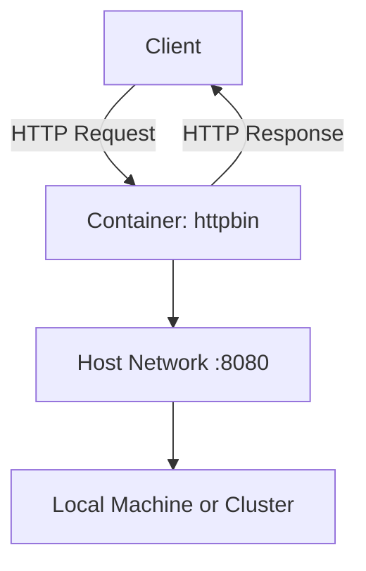

# Hosting httpbin in a Containerized Environment

## 1. What is httpbin?
[httpbin](https://httpbin.org) is a popular HTTP request and response mock service.  
It provides ready-to-use endpoints that allow developers to:
- Test HTTP methods such as `GET`, `POST`, `PUT`, and `DELETE`.
- Inspect headers, query parameters, and request bodies.
- Simulate different response codes and behaviors.

---

## 2. Why Host httpbin Yourself?
While the public httpbin.org service is available, hosting httpbin in a container has several advantages:

| Benefit         | Description                                                                 |
|-----------------|-----------------------------------------------------------------------------|
| **Reliability** | Avoid dependency on the public instance.                                   |
| **Consistency** | Ensure the same version is always used across environments.                |
| **Security**    | Keep API testing isolated within your own network.                         |
| **Integration** | Easily connect with local tools, CI/CD pipelines, or Kubernetes clusters.  |

---

## 3. Running httpbin as a Container
The service is officially available as a Docker image (`kennethreitz/httpbin`).  
Running it locally is straightforward:

    docker run -d -p 8080:80 kennethreitz/httpbin

Once started, httpbin will be available at:

    http://localhost:8080

Example usage:
- `GET /get` → Returns request data.
- `POST /post` → Echoes posted data.
- `GET /status/404` → Returns a 404 response.

---

## 4. Architecture Overview
The following diagram shows how httpbin is hosted in a container and accessed by clients:

---

## 5. Use Cases
- **API Prototyping**: Quickly mock endpoints before backend is ready.  
- **CI/CD Testing**: Validate API clients in automated pipelines.  
- **Learning Tool**: Understand headers, cookies, and HTTP methods interactively.  

---

## 6. Conclusion
By running httpbin in a containerized environment, you gain a **reliable, reproducible, and secure** way to test and experiment with HTTP interactions.  
This approach is especially valuable when integrating with modern DevOps practices and Kubernetes-based platforms.
